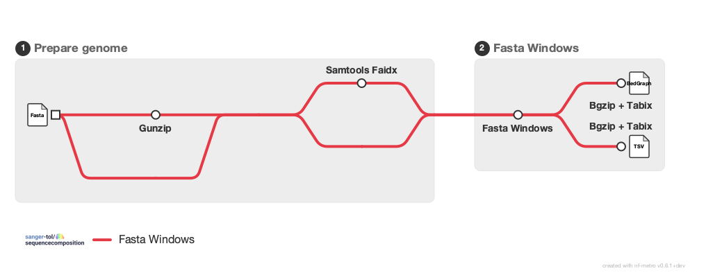

<h1>
  <picture>
    <source media="(prefers-color-scheme: dark)" srcset="docs/images/sanger-tol-sequencecomposition_logo_dark.png">
    
  </picture>
</h1>

[](https://github.com/codespaces/new/sanger-tol/sequencecomposition)
[](https://github.com/sanger-tol/sequencecomposition/actions/workflows/nf-test.yml)
[](https://github.com/sanger-tol/sequencecomposition/actions/workflows/linting.yml)
[](https://doi.org/10.5281/zenodo.14358108)
[](https://www.nf-test.com)

[](https://www.nextflow.io/)
[](https://github.com/nf-core/tools/releases/tag/3.5.2)
[](https://docs.conda.io/en/latest/)
[](https://www.docker.com/)
[](https://sylabs.io/docs/)
[](https://cloud.seqera.io/launch?pipeline=https://github.com/sanger-tol/sequencecomposition)

## Introduction

**sanger-tol/sequencecomposition** is a bioinformatics analysis pipeline that extracts statistics from a genome about its sequence composition.

<picture>
  <source media="(prefers-color-scheme: dark)" srcset="docs/images/sanger-tol-sequencecomposition_metro_map_dark.png">
  
</picture>

The pipeline takes an assembly Fasta file (possibly compressed), runs `fasta_windows` on it, and transforms the outputs into files more practical for downstream use.

Steps involved:

- Run `fasta_windows` on the assembly Fasta file.
- Extract single-statistics bedGraph files from the multi-statistics TSV
  files `fasta_windows` outputs.
- Compress and index all bedGraph and TSV files with `bgzip` and `tabix`.

## Usage

> [!NOTE]
> If you are new to Nextflow and nf-core, please refer to [this page](https://nf-co.re/docs/usage/installation) on how to set-up Nextflow. Make sure to [test your setup](https://nf-co.re/docs/usage/introduction#how-to-run-a-pipeline) with `-profile test` before running the workflow on actual data.

The easiest is to provide the path of the Fasta file to analyse like this:

```console
nextflow run sanger-tol/sequencecomposition --fasta /path/to/genome.fa
```

> [!WARNING]
> Please provide pipeline parameters via the CLI or Nextflow `-params-file` option. Custom config files including those provided by the `-c` Nextflow option can be used to provide any configuration _**except for parameters**_; see [docs](https://nf-co.re/docs/usage/getting_started/configuration#custom-configuration-files).

The pipeline also supports bulk downloads through a sample-sheet.
More information about this mode on our [pipeline website](https://pipelines.tol.sanger.ac.uk/sequencecomposition/usage).

## Credits

sanger-tol/sequencecomposition was originally written by [Matthieu Muffato](https://github.com/muffato).

We thank the following people for their extensive assistance in the development of this pipeline:

- [Priyanka Surana](https://github.com/priyanka-surana) for providing reviews.
- [Tyler Chafin](https://github.com/tkchafin) for updates.

## Contributions and Support

If you would like to contribute to this pipeline, please see the [contributing guidelines](.github/CONTRIBUTING.md).

For further information or help, don't hesitate to get in touch on the [Slack `#pipelines` channel](https://sangertreeoflife.slack.com/channels/pipelines). Please [create an issue](https://github.com/sanger-tol/sequencecomposition/issues/new/choose) on GitHub if you are not on the Sanger slack channel.

## Citations

If you use sanger-tol/sequencecomposition for your analysis, please cite it using the following doi: [10.5281/zenodo.14358108](https://doi.org/10.5281/zenodo.14358108)

An extensive list of references for the tools used by the pipeline can be found in the [`CITATIONS.md`](CITATIONS.md) file.

This pipeline uses code and infrastructure developed and maintained by the [nf-core](https://nf-co.re) community, reused here under the [MIT license](https://github.com/nf-core/tools/blob/main/LICENSE).

> **The nf-core framework for community-curated bioinformatics pipelines.**
>
> Philip Ewels, Alexander Peltzer, Sven Fillinger, Harshil Patel, Johannes Alneberg, Andreas Wilm, Maxime Ulysse Garcia, Paolo Di Tommaso & Sven Nahnsen.
>
> _Nat Biotechnol._ 2020 Feb 13. doi: [10.1038/s41587-020-0439-x](https://dx.doi.org/10.1038/s41587-020-0439-x).
